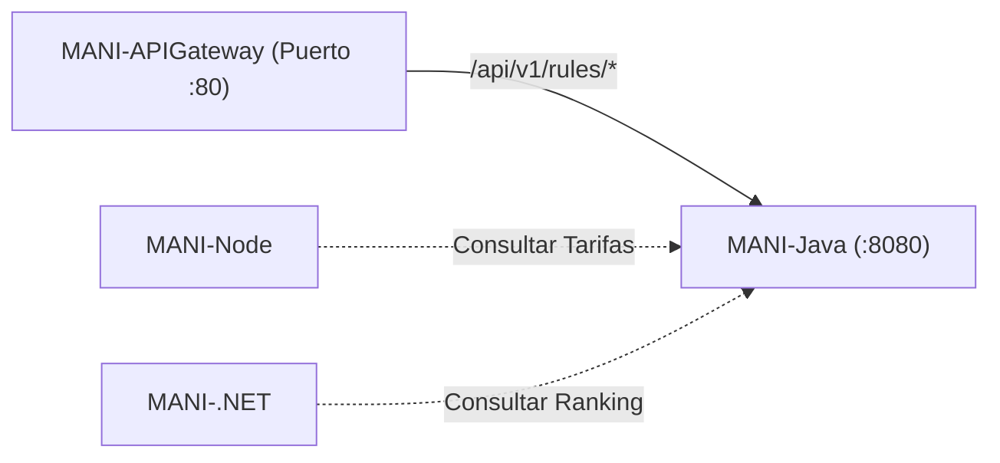

# MANI-Java — Motor de Reglas de Negocio de MANI

Microservicio del ecosistema **MANI** (*TRAMA · Ingeniería de Software*), desarrollado en **Java 17 y Spring Boot 3.3.x**, responsable del motor de reglas de negocio y cálculo dinámico de tarifas.

Este repositorio encapsula la lógica de dominio requerida para la evaluación de condiciones por tenant, verificación de límites tarifarios y ranking ponderado de profesionales.

---

## 🏛️ Rol en la Arquitectura SOA (ADR-0019)

Dentro de la arquitectura de servicios de MANI, **`MANI-Java`** opera como un servicio de lógica de decisión y cálculo puro:

* **Puerto Interno:** `8080`
* **Exposición Externa:** Vía **`MANI-APIGateway`** bajo el prefijo `/api/v1/rules/*`.
* **Capacidades de Negocio (SRS V3):**
  - **RF-02:** Evaluación de reglas configurables por tenant sin almacenar valores fijos en código.
  - **RF-13:** Algoritmo de ranking y ordenamiento de aliados por calificación y experiencia.
  - **RF-16 / RF-22:** Validación contra tarifario base, cálculo de recargos por día/horario y límites de cobro.
* **Interacción en el Ecosistema:**
  - Puede ser consultado por **`MANI-Node`** durante el ciclo de cotización previa al guardado.
  - Puede ser consultado por **`MANI-.NET`** para priorizar aliados antes del despacho.
  - Expuesto a **`MANI-Flutter`** a través del API Gateway para cotizaciones dinámicas en tiempo real.



---

## 🚀 Endpoints Principales

| Método | Ruta en Gateway | Descripción | Body Requerido |
| :--- | :--- | :--- | :---: |
| `GET` | `/api/v1/rules/health` | Verificación de estado del motor de reglas. | No |
| `POST` | `/api/v1/rules/evaluate-rate` | Cálculo de precio final con desglose de recargos. | Sí (JSON) |
| `POST` | `/api/v1/rules/rank-allies` | Ordenamiento y ponderación de aliados para servicio. | Opcional |

### Ejemplo: Evaluación de Tarifa (`POST /api/v1/rules/evaluate-rate`)
**Petición:**
```json
{
  "basePrice": 45000,
  "isWeekend": true,
  "category": "Semipermanente"
}
```

**Respuesta (`200 OK`):**
```json
{
  "service": "MANI-Java",
  "basePrice": 45000.0,
  "surcharge": 5000.0,
  "finalPrice": 50000.0,
  "ruleApplied": "REGLA-FIN-DE-SEMANA (+5000)",
  "status": "APPLIED",
  "correlationId": "c9a4b2a8-1234-5678-90ab-cdef12345678"
}
```

---

## 🛠️ Stack Tecnológico

* **Lenguaje:** Java 17 LTS (Eclipse Temurin).
* **Framework:** Spring Boot 3.3.4 (Spring Web, Spring Test).
* **Gestor de Dependencias:** Apache Maven 3.9+.
* **Contenerización:** Docker multi-stage (Maven builder + JRE Alpine).

---

## ⚙️ Configuración (`application.properties`)

```properties
server.port=8080
spring.application.name=mani-java

# Formato de logs con correlation ID
logging.pattern.console=%d{yyyy-MM-dd HH:mm:ss} [%thread] %-5level %logger{36} - [Correlation: %X{X-Correlation-ID}] %msg%n
```

---

## 💻 Ejecución Local

### Opción 1: Con Maven
```bash
# Compilar proyecto
mvn clean package -DskipTests

# Ejecutar aplicación
mvn spring-boot:run
```

### Opción 2: Con Docker
```bash
# Construir imagen Docker
docker build -t mani-rules-java:local .

# Ejecutar contenedor en puerto 8080
docker run -d -p 8080:8080 --name mani-rules mani-rules-java:local
```

---

## 👥 Equipo y Gobernanza
* **Organización:** [TRAMA · Ingeniería de Software](https://github.com/Trama-AS)
* **Repositorio Oficial:** [MANI-Java](https://github.com/Trama-AS/MANI-Java)
